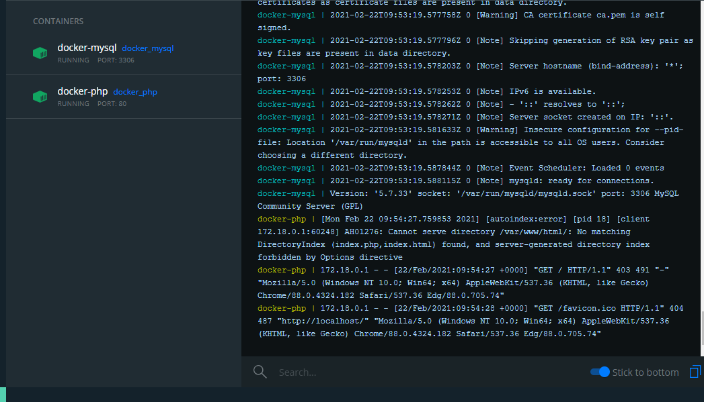
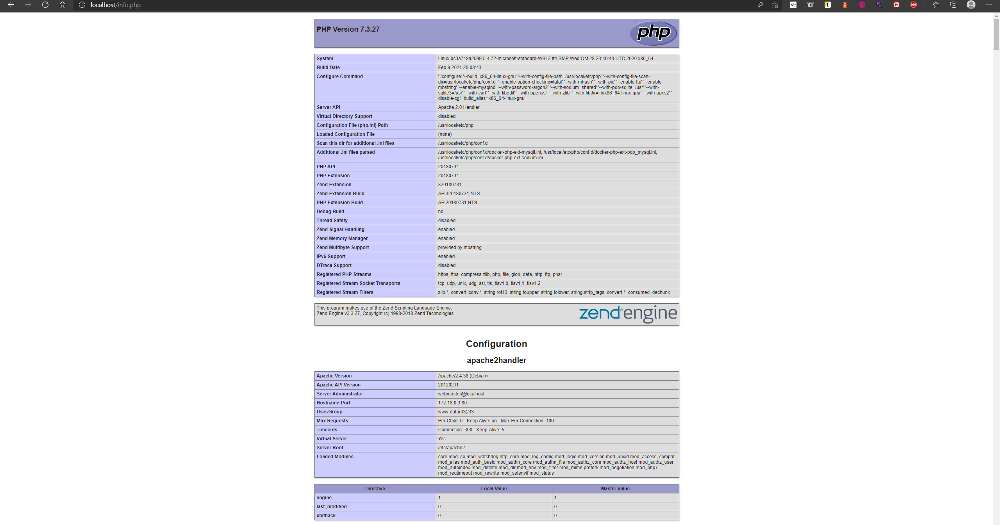

# Docker: PHP & MySQL

Instalacion un ambiente de desarrollo local para trabajar con [PHP](https://www.php.net/) y [MySQL](https://www.mysql.com/) utilizando [Docker](https://www.docker.com). 

Utilizar *Docker* es sencillo, pero existen tantas imágenes, versiones y formas para crear los contenedores que hacen tediosa esta tarea. Este proyecto ofrece una instalación rápida, con versiones estandar y con la mínima cantidad de modificaciones a las imágenes de Docker. Viene configurado con  `PHP 7.3` y `MySQL 5.7`.

## Requerimientos

* [Docker Desktop](https://www.docker.com/products/docker-desktop)

## Configurar el ambiente de desarrollo

Puedes utilizar la configuración por defecto, pero en ocasiones es recomendable modificar la configuración para que sea igual al servidor de producción. La configuración se ubica en el archivo `.env` con las siguientes opciones:

* `PHP_VERSION` versión de PHP ([Versiones disponibles de PHP](https://github.com/docker-library/docs/blob/master/php/README.md#supported-tags-and-respective-dockerfile-links)).
* `PHP_PORT` puerto para servidor web.
* `MYSQL_VERSION` versión de MySQL([Versiones disponibles de MySQL](https://hub.docker.com/_/mysql)).
* `MYSQL_USER` nombre de usuario para conectarse a MySQL.
* `MYSQL_PASSWORD` clave de acceso para conectarse a MySQL.
* `MYSQL_DATABASE` nombre de la base de datos que se crea por defecto.

## Instalar el ambiente de desarrollo

La instalación se hace en línea de comandos:

```zsh
docker-compose up -d
```
Puedes vaidar que se ha instalado correctamente accediendo a: [http://localhost/info.php](http://localhost/info.php)

## Comandos disponibles

Una vez instalado, se pueden utilizar los siguiente comandos:

```zsh
docker-compose start    # Iniciar el ambiente de desarrollo
docker-compose stop     # Detener el ambiente de desarrollo
docker-compose down     # Detener y eliminar el ambiente de desarrollo.
```

## Estructura de Archivos

* `/docker/` contiene los archivos de configuración de Docker.
* `/www/` carpeta para los archivos PHP del proyecto.

## Accesos

### Web

* http://localhost/

### Base de datos

Existen dos dominios para conectarse a base de datos.

* `mysql`: para conexión desde los archivos PHP.
* `localhost`: para conexiones externas al contenedor.

Las credenciales por defecto para la conexión son:

| Usuario | Clave | Base de datos |
|:---:|:---:|:---:|
| dbuser | dbpass | dbname |


### Capturas de pantalla



